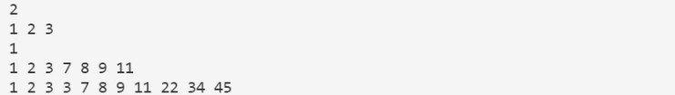
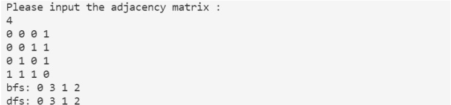
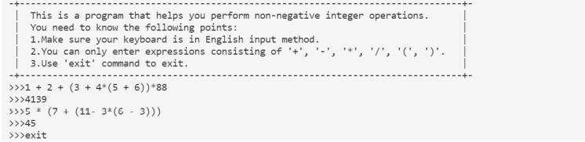

## MySTL

C++STL模板库基本组件的一个复现

## 模板设计

#### vector

vector模板的设计主要采用动态数组的方式，通过C++内置的内存管理类allocator对内存进行管理。当当前的数组容量不够时，会将数组的容量扩展至原来的二倍。由于vector底层是一段连续的内存空间，故可以对其进行随机存取，而且可以将内存地址即指针作为其迭代器。在模板设计过程最多涉及的操作是将一块连续内存拷贝到另一块的操作，因为vecotr的插入操作、删除操作和扩容操作都涉及到大量的内存移动，这也是vector的缺点所在。这些操作的完成全部使用了标准库内置的`uninitialized_copy()`。vector数据成员有start，finish，end_of_storage_。

#### list

list的内存为不连续的一个个节点，对list的内存管理采用allocator。list设计采用双向链表的方式， 设计时加入了一个尾部空节点，这个空节点又指向头节点，形成一个双向循环链表。由于链表的内存空间不是连续的，所以无法对其进行随机存取，故而对其迭代器的设计采取独立出来的方式，建立一个list的iterator类，然后通过各个节点间的指针指向关系定义迭代器的`++`操作和`--`操作。list无法随机存取的这种限制也导致其无法使用STL中的sort等需要容器能够随机存取的算法模板。list的数据成员为指向尾部空节点的node。

#### stack

stack的设计采用静态数组的方式，这种方式有很多限制，而初始化时必须指定栈的大小。stack的内存管理采用allcator类。在设计的时候通过C标准库中的`assert()`对一些非法操作进行限制。

#### queue

queue的设计采用静态数组的方式，这种方式有很多限制，而初始化时必须指定队列的大小。queue的内存管理采用allocator类。在设计的时候通过C标准库中的`assert()`对一些非法操作进行限制。队列通过一个head, 一个tail，分别指示队头和队尾，当两个游标到达内存块末，如果内存块首为空，则会移动到内存块首。拷贝构造函数和赋值运算符均通过从队首到队尾的遍历进行拷贝。

#### map

map的底层设计通过有序的vector实现（平衡二叉树太难了~），核心在于二分查找。首先通过一个pair存储键值对，而pair中的键是进行插入和查找的关键。对于map的功能实现主要在于插入上，由于在整个使用过程中维护着一个有序的vector，所以当需要插入时可通过二分查找找到需要插入的位置，然后将其插入，这种实现相比于平衡二叉树最大的弊端在于vector的弊端，因为vector的插入删除的效率比之于二叉树要慢很多，而查找的效率并不会慢平衡二叉树多少。对于`[]`运算符的重载的关键在于如果`[]`中的键未找到，就要以这个键建立一个没有值的pair插入vector并返回pair中值的引用。由于底层使用的是vector所以没有必要再为map设计迭代器，只需要将vector的迭代器拿来用。

#### 算法模板设计

在算法库中，主要实现了几种排序和查找算法，通过命名MLT(My Library Template)对整个文件中的函数进行保护，防止冲突。每个函数的模板主要借助于迭代器，对`[First, Last)`内的数据进行排序。而三种排序算法中只有冒泡能够对无法进行随机存取的容器排序。而二分查找也只能对有序的且可进行随机存取的容器进行查找。

## 功能介绍及测试

#### vector

vector基本上支持了与STL中vector相同的功能，包括各种初始化，插入，删除，尾部添加，获取首部元素，获取尾部元素，获取长度，获取容量，判断是否为空等等。通过迭代器可与模板库协同进行一些查找，排序等操作。

其测试程序如下

```c++
#include <iostream>
#include "vector.h"
#include "algo.h"

using std::cin;
using std::cout;
using std::endl;
using std::string;

template<typename T>
void output(T& v)
{   //通过迭代器对vector中的数据进行输出
    for (auto iter = v.begin(); iter != v.end(); iter++) {
        cout << *iter << " ";
    }
    cout << endl;
}

int main(void)
{
    int a[10] = {2, 3, 1, 7, 5, 11, 4, 8, 9, 10};
    vector<int> iv(a, a + 10); //通过数组对其进行初始化
    output(iv);
    cout << iv.size() << endl; //获取长度
    cout << iv.capacity() << endl; //获取容量
    auto iter = MTL::find(iv.begin(), iv.end(), 7); //通过迭代器与算法模板协作进行查找操作
    iter = iv.insert(iter, 111);  //在7处进行插入操作
    output(iv);
    iter = iv.erase(iter, iter + 4); //从111处开始删除四个数
    output(iv);
    iter = iv.insert(iter, 5, 0); //从删除结束处插入5个0
    output(iv);
    iv.erase(iter);
    MTL::quick_sort(iv.begin(), iv.end()); //快速排序
    output(iv);
    iv.erase(iv.begin(), iv.begin() + 5);
    output(iv);
    cout << iv.front() << endl; //获取头部元素
    cout << iv.back() << endl;  //获取尾部元素
    string st[5] = {"hello", "world", "good", "job", "great"}; //使用string类进行测试
    vector<string> sv(st, st + 5);
    output(sv);
    MTL::quick_sort(sv.begin(), sv.end());
    output(sv);
    sv.pop_back();
    sv.pop_back();
    output(sv);
    return 0;
}
```

运行结果：


#### list

list的功能与vector大抵相同，不同在于list无法进行随机存取，故而不能重载`[]`运算符，也无法使用一些需要随机存取的算法模板。但list的插入删除效率要比vector高很多。故而如果一些数据对随机存取没有要求时，应该更倾向于选择list。list因为其高效的插入和删除操作，有一些特殊功能，比如unique()函数可以删除序列中连续且相同的元素至一个，reverse()函数可以对链表进行反转，merge()函数可以对两个有序链表进行合并。

其测试程序如下：

```C++
#include <iostream>
#include "list.h"
#include "algo.h"

using std::cin;
using std::cout;
using std::endl;
using std::string;

template<typename T>
void output(T& l) 
{
    for (auto iter = l.begin(); iter != l.end(); iter++) {
        cout << *iter << " ";
    }
    cout << endl;
}

int main(void)
{
    int a[5] = {5, 3, 2, 7, 9};
    list<int> lx(a, a + 5); //利用数组初始化
    output(lx);
    cout << lx.front() << endl; //获取首部元素
    cout << lx.back() << endl;  //获取尾部元素
    cout << lx.size() << endl; //获取序列大小
    lx.push_back(111); //尾部添加
    lx.push_front(222); //头部添加
    output(lx);
    lx.reverse(); //反转
    output(lx);
    auto iter = MTL::find(lx.begin(), lx.end(), 7); //利用迭代器进行查找
    lx.insert(iter, 333); //插入
    output(lx);
    lx.remove(222);  //移除元素
    output(lx);
    int b[5] = {7, 6, 2, 5, 4};
    list<int> l2(b, b + 5);
    output(l2);
    MTL::bubble_sort(lx.begin(), lx.end()); //冒泡排序
    MTL::bubble_sort(l2.begin(), l2.end());
    lx.merge(l2); //对两个有序链表进行合并
    output(lx);
    lx.unique();  //删除连续且相通的元素
    output(lx);
    string s[3] = {"hello", "good", "haha"}; //使用string类进行测试
    list<string> str(s, s + 3);
    output(str);
    str.clear();
    return 0;
}
```

运行结果：


#### stack

栈主要提供push()、pop()、top()、empty(), size()这五种操作。

测试程序如下：

```c++
#include <iostream>
#include <ctime>
#include "stack.h"

using std::cin;
using std::cout;
using std::endl;
using std::string;

int main(void)
{
    stack<int> s(100); //设定栈容量
    for (int i = 0; i < 10; i++) {
        int t = rand()%100;
        cout << t << " ";
        s.push(t); //入栈
    }
    cout << endl;
    cout << s.size() << endl; //输出当前元素个数
    while (!s.empty()) {
        cout << s.top() << " "; //获取栈顶元素
        s.pop(); //出栈
    }
    cout << endl;
    stack<string> str(100); //使用string类进行测试
    str.push("hello"); cout << "hello" << " ";
    str.push("world"); cout << "world" << " ";
    str.push("good");  cout << "good"  << " ";
    str.push("great"); cout << "great" << " ";
    cout << endl;
    cout << str.size() << endl;
    while (!str.empty()) {
        cout << str.top() << " ";
        str.pop();
    }
    cout << endl;
    cout << str.size() << endl;
    return 0;
}
```

运行结果：


#### queue

queue提供front(), back(), push(), pop(),empty(),size()这六种操作。

测试程序如下：

```c++
#include <iostream>
#include <ctime>
#include "queue.h"

using std::cin;
using std::cout;
using std::endl;
using std::string;

int main(void)
{
    queue<int> q(100);
    cout << q.capacity() << endl;
    for (int i = 0; i < 10; i++) {
        int t = rand()%100;
        cout << t << " ";
        q.push(t);  //入队
    }
    cout << endl;
    cout << q.size() << endl;
    while (!q.empty())
    {
        cout << q.front() << " "; //输出队首
        q.pop(); //出队
    }
    cout << endl;
    cout << q.size() << endl;
    queue<string> str(3); //使用string类进行测试
    str.push("hello");
    str.push("world");
    str.push("good");
    str.pop();
    str.pop();
    str.push("great");
    while (!str.empty()) {
        cout << str.front() << " ";
        str.pop();
    }
    cout << endl;
    return 0;
}
```

运行结果：


#### map

map提供了插入删除查找操作，以及最为重要的`[]`重载操作，当然还有迭代器。可对任意两种类型建立关联。其插入和删除的效率较慢。

测试程序：

```c++
#include <iostream>
#include "map.h"

using std::cin;
using std::cout;
using std::endl;
using std::string;

void output(map<string, int>& m) {
    for (auto iter = m.begin(); iter != m.end(); iter++) { //通过迭代器输出
        cout << iter->first << " : " << iter->second << endl;
    }
    cout << endl;
}

int main(void)
{
    map<string, int> m;
    m["John"] = 82; //[]的使用
    m["Mike"] = 79;
    m["July"] = 76;
    m["Jack"] = 88;
    output(m);
    auto iter = m.find("Jack"); //查找操作，返回迭代器
    (iter->second)++;
    m["jack"]++;
    m.insert(pair<string, int>("LiMing", 81)); //插入操作
    output(m);
    cout << m.size() << endl;
    m.erase("Mike"); //删除操作
    output(m);
    m.clear();
    cout << m.size() << endl;
    return 0;
}
```

运行结果：


#### 算法模板

算法模板排序主要提供堆排序、快速排序、和冒泡排序的功能。查找主要提供顺序查找和二分查找。

测试程序如下：

```c++
#include <iostream>
#include "algo.h"
#include "vector.h"

using std::cin;
using std::cout;
using std::endl;
using std::string;

void output(vector<int>& v) {
    for (auto iter = v.begin(); iter != v.end(); iter++) {
        cout << *iter << " ";
    }
    cout << endl;
}

int main(void)
{
    vector<int> v(3);
    v[0] = 3; v[1] = 2; v[2] = 1;

    auto ite = MTL::find(v.begin(), v.end(), 2);
    cout << *ite << endl;

    MTL::bubble_sort(v.begin(), v.end());
    output(v);

    ite = MTL::binary_search(v.begin(), v.end(), 1);
    cout << *ite << endl;

    v.push_back(11); v.push_back(7); v.push_back(9); v.push_back(8);
    MTL::quick_sort(v.begin(), v.end());
    output(v);

    v.push_back(45); v.push_back(34); v.push_back(22); v.push_back(3);
    MTL::heap_sort(v.begin(), v.end());
    output(v);

    return 0;
}
```

运行结果：



#### 图的遍历及四则运算程序运行结果（代码见压缩包）



